# ESP32 CrowPanel Compass & Multi-Function Display

[](https://www.espressif.com/en/sdks/esp-arduino)
[](https://www.elecrow.com/wiki/CrowPanel_2.1inch-HMI_ESP32_Rotary_Display_480_IPS_Round_Touch_Knob_Screen.html)
[](https://www.espressif.com/en/solutions/low-power-solutions/esp-now)
[](LICENSE)
[](https://lvgl.io)

Marine instrument display for [Elecrow CrowPanel 2.1" HMI](https://www.elecrow.com/wiki/CrowPanel_2.1inch-HMI_ESP32_Rotary_Display_480_IPS_Round_Touch_Knob_Screen.html) (ESP32-S3, 480x480 IPS round touchscreen, rotary knob). Receives via ESP-NOW:
- Compass heading, pitch and roll from [CMPS14-ESP32-SignalK-gateway](https://github.com/mkvesala/CMPS14-ESP32-SignalK-gateway) compass
- GNSS position, speed over ground (SOG) and course over ground (COG) from [UBLOX-ESP32-SignalK-gateway](https://github.com/mkvesala/UBLOX-ESP32-SignalK-gateway) GNSS sensor
- Temperature, air pressure and relative humidity from [BME280-ESP32-SignalK-gateway](https://github.com/mkvesala/BME280-ESP32-SignalK-gateway)
- House battery bank voltage, current and SoC as well as starter battery voltage from [VEDirect-ESP32-SignalK-gateway](https://github.com/mkvesala/VEDirect-ESP32-SignalK-gateway)
- Engine exhaust temperature, fuel tank level and fresh water tank level from [HALMET-ESP32-SignalK-gateway](https://github.com/mkvesala/HALMET-ESP32-SignalK-gateway)
- Depth below surface and below keel, relayed from the SignalK server by [SignalK-ESP-NOW-gateway](https://github.com/mkvesala/SignalK-ESP-NOW-gateway)

Displays values on a round LVGL UI. User interaction via rotary knob (rotate or press). No touch screen implementation yet.

Different screens selectable by rotating the knob:
- **Compass screen** — rotating compass rose with HEADING (HDG T), COG and SOG views
- **Attitude screen** — toggle between artificial horizon, pitch/roll min/max and depth views
- **Weather screen** — toggle between temperature, pressure and humidity views
- **Battery screen** — toggle between house voltage, house current, house SoC and starter voltage views
- **Engine screen** — toggle between exhaust temperature, fuel tank and fresh water tank views
- **Brightness screen** — backlight brightness adjustment with NVS persistence

Developed and tested on:
- [Elecrow CrowPanel 2.1" HMI ESP32 Rotary Display](https://www.elecrow.com/wiki/CrowPanel_2.1inch-HMI_ESP32_Rotary_Display_480_IPS_Round_Touch_Knob_Screen.html)
- [ESP32 board package](https://github.com/espressif/arduino-esp32) (3.3.8)
- [Arduino IDE](https://www.arduino.cc/en/software/) (2.3.8)
- [LVGL](https://lvgl.io/) (9.5.0)
- [Arduino GFX Library](https://github.com/moononournation/Arduino_GFX) (1.6.5)
- [PCF8574 Library](https://github.com/xreef/PCF8574_library) (2.4.0)
- [SquareLine Studio](https://squareline.io/) (1.6.0) for UI design

Integrated via ESP-NOW with:
- [CMPS14-ESP32-SignalK-gateway](https://github.com/mkvesala/CMPS14-ESP32-SignalK-gateway) (v1.4.0) compass sender
- [UBLOX-ESP32-SignalK-gateway](https://github.com/mkvesala/UBLOX-ESP32-SignalK-gateway) (v1.0.0) GNSS sender
- [BME280-ESP32-SignalK-gateway](https://github.com/mkvesala/BME280-ESP32-SignalK-gateway) (v1.0.1) weather data sender
- [VEDirect-ESP32-SignalK-gateway](https://github.com/mkvesala/VEDirect-ESP32-SignalK-gateway) (v1.0.0) battery data sender
- [HALMET-ESP32-SignalK-gateway](https://github.com/mkvesala/HALMET-ESP32-SignalK-gateway) (v1.3.0) engine, fuel tank and fresh water tank data sender
- [SignalK-ESP-NOW-gateway](https://github.com/mkvesala/SignalK-ESP-NOW-gateway) (v1.0.0) depth relay from the SignalK server

## Purpose of the project

This is one of my individual digital boat projects. Use at your own risk. Not for safety-critical navigation.

1. I needed a compact multi-function display near the helm, receiving data wirelessly from the compass and other devices, independently from WiFi and SignalK
2. I wanted to learn LVGL and SquareLine Studio for UI development
3. I continued learning ESP32 C++ patterns and FreeRTOS from the companion compass project

## Release history

| Release | Comment |
|---------|---------|
| v4.2.0 | Latest release. AttitudeScreen DEPTH view — graphical depth situation (surface line, keel line, moving sea bottom, grounding caution) from depth relayed by SignalK-ESP-NOW-gateway. EngineScreen FRESHWATER view — fresh water tank arc gauge from HALMET-ESP32-SignalK-gateway. Bug fix: EngineScreen `showView()` now hides all three view roots, the water gauge container no longer covers the exhaust and fuel views. See [CHANGELOG](CHANGELOG.md) for details. |
| v4.1.0 | EngineScreen added — exhaust temperature with session min/max and trend, fuel tank arc gauge with dynamic color. ESP-NOW integration with HALMET-ESP32-SignalK-gateway. Bug fix: AttitudeScreen MINMAX view now reflects pitch and roll extremes recorded across the full runtime, not only while the Attitude screen was active. See [CHANGELOG](CHANGELOG.md) for details. |
| v4.0.0 | Leveling functionality removed — CrowPanel is now receive-only. CompassScreen with 3-view cycle (HEADING → COG → SOG), GNSS data integration from UBLOX-ESP32-SignalK-gateway. See [CHANGELOG](CHANGELOG.md) for details. |
| v3.1.1 | Patching documentation only. |
| v3.1.0 | AttitudeScreen redesigned with separate views for real-time attitude, min/max tracking and for performing attitude leveling (triggered by count-down, canceled by button press/rotate). See [CHANGELOG](CHANGELOG.md) for details. |
| v3.0.0 | Library upgrade: ESP32 board package 2.0.14 → 3.3.7, LVGL 8.3.6 → 9.5.0, Arduino GFX Library 1.3.1 → 1.6.5. This is a compatibility change - v2.1.0 does not compile on the new libraries. See [CHANGELOG](CHANGELOG.md) for details. |
| v2.1.0 | Introduces BatteryScreen and `BatteryUI` UI adapter class. Minor modifications to WeatherScreen and `WeatherUI`. See [CHANGELOG](CHANGELOG.md) for details. |
| v2.0.0 | Refactored for scalability in screen management. Introduces `IScreenUI` interface as an abstract base class for the actual UI adapter classes. Breaking change in ESP-NOW protocol: updated with framed packets, introducing `ESPNowPacket` and `ESPNowHeader` structs. Adds `WeatherUI` UI adapter class and WeatherScreen UI to show temperature, humidity and pressure. See [CHANGELOG](CHANGELOG.md) for details. |
| v1.0.0 | First stable release. See [CHANGELOG](CHANGELOG.md) for details - including pre-releases. |

## Classes

Class diagram including the companion projects:


**`CrowPanelApplication`:**
- Owns: `Arduino_ESP32RGBPanel`, `Arduino_RGB_Display`, `Arduino_SWSPI`, `PCF8574`, `ESPNowReceiver`, `CompassUI`, `AttitudeUI`, `WeatherUI`, `BatteryUI`, `EngineUI`, `BrightnessUI`, `RotaryEncoder`, `ScreenManager`
- Responsible for: orchestrating everything within the main program

**`ESPNowReceiver`:**
- Responsible for: receiving `HeadingData`, `GnssData`, `WeatherDelta`, `BatteryDelta`, `HALMETEngineDelta`, `HALMETTankDelta`, `HALMETWaterDelta` and `DepthDelta` broadcasts via ESP-NOW (receive-only)
- Keeps a dedicated RX timestamp for depth (`lastDepthRxMillis()`), because depth is relayed and its freshness cannot be judged from the payload alone
- Owned by: `CrowPanelApplication`

**`RotaryEncoder`:**
- Uses: `PCF8574`
- Responsible for: reading rotary knob rotation and knob button press
- Owned by: `CrowPanelApplication`

**`IScreenUI`:**
- Abstract base class for UI adapter class implementations

**`CompassUI`:**
- Realizes: `IScreenUI`
- Uses: `ESPNowReceiver`
- Responsible for: updating LVGL UI objects on the compass screen based on heading and GNSS data; 3-view cycle (HEADING / COG / SOG)
- Owned by: `CrowPanelApplication`

**`AttitudeUI`:**
- Realizes: `IScreenUI`
- Uses: `ESPNowReceiver`
- Responsible for: updating LVGL UI objects on the attitude screen based on pitch, roll and depth data; 3-view cycle (ATTITUDE / MINMAX / DEPTH)
- Owned by: `CrowPanelApplication`

**`WeatherUI`:**
- Realizes: `IScreenUI`
- Uses: `ESPNowReceiver`
- Responsible for: updating LVGL UI objects on the weather screen based on temperature, pressure and humidity data.
- Owned by: `CrowPanelApplication`  

**`BatteryUI`:**
- Realizes: `IScreenUI`
- Uses: `ESPNowReceiver`
- Responsible for: updating LVGL UI objects on the battery screen based on battery data.
- Owned by: `CrowPanelApplication`

**`EngineUI`:**
- Realizes: `IScreenUI`
- Uses: `ESPNowReceiver`
- Responsible for: updating LVGL UI objects on the engine screen based on engine exhaust, fuel tank and fresh water tank data; 3-view cycle (EXHAUST / FUEL0 / FRESHWATER)
- Owned by: `CrowPanelApplication`

**`BrightnessUI`:**
- Realizes: `IScreenUI`
- Uses: `Preferences`
- Responsible for: backlight brightness adjustment with NVS persistence, updating LVGL UI objects on the brightness screen
- Owned by: `CrowPanelApplication`

**`ScreenManager`:**
- Depends on: `IScreenUI*`
- Responsible for: Screen carousel management
- Owned by: `CrowPanelApplication`

## Features

### Compass screen

 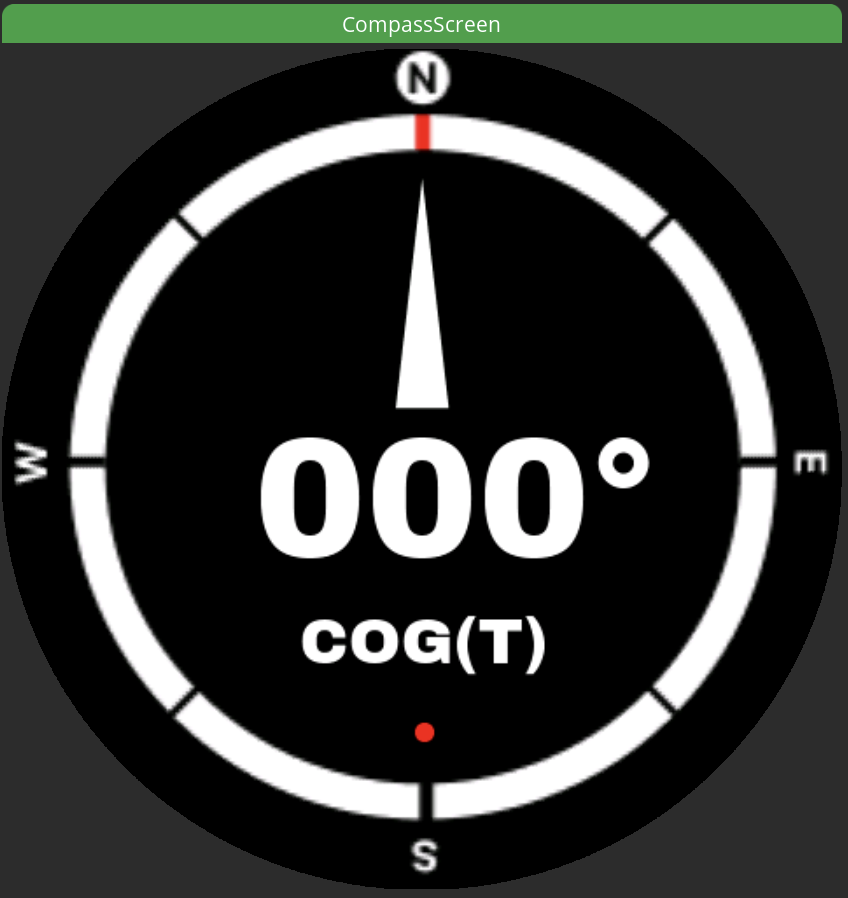 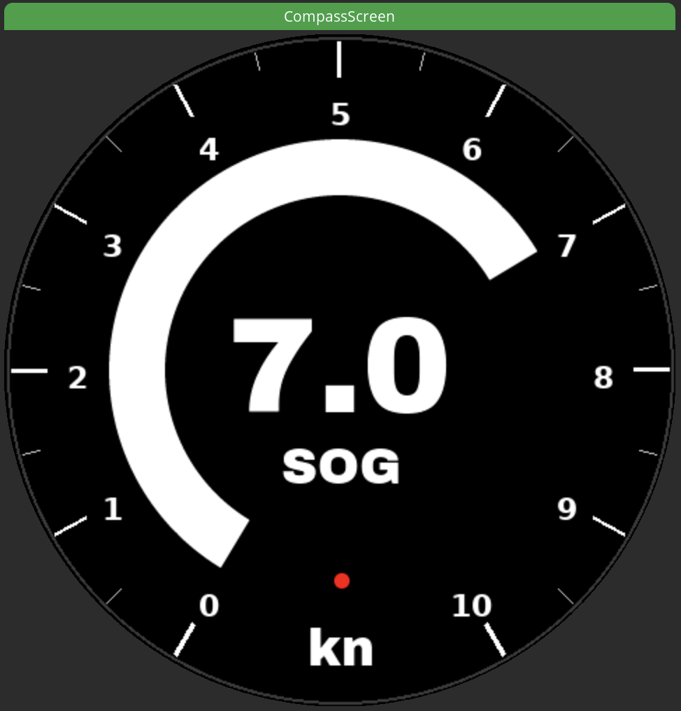  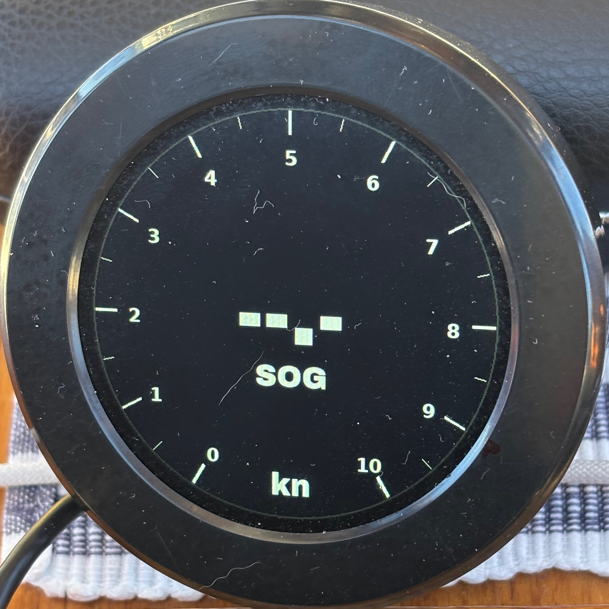 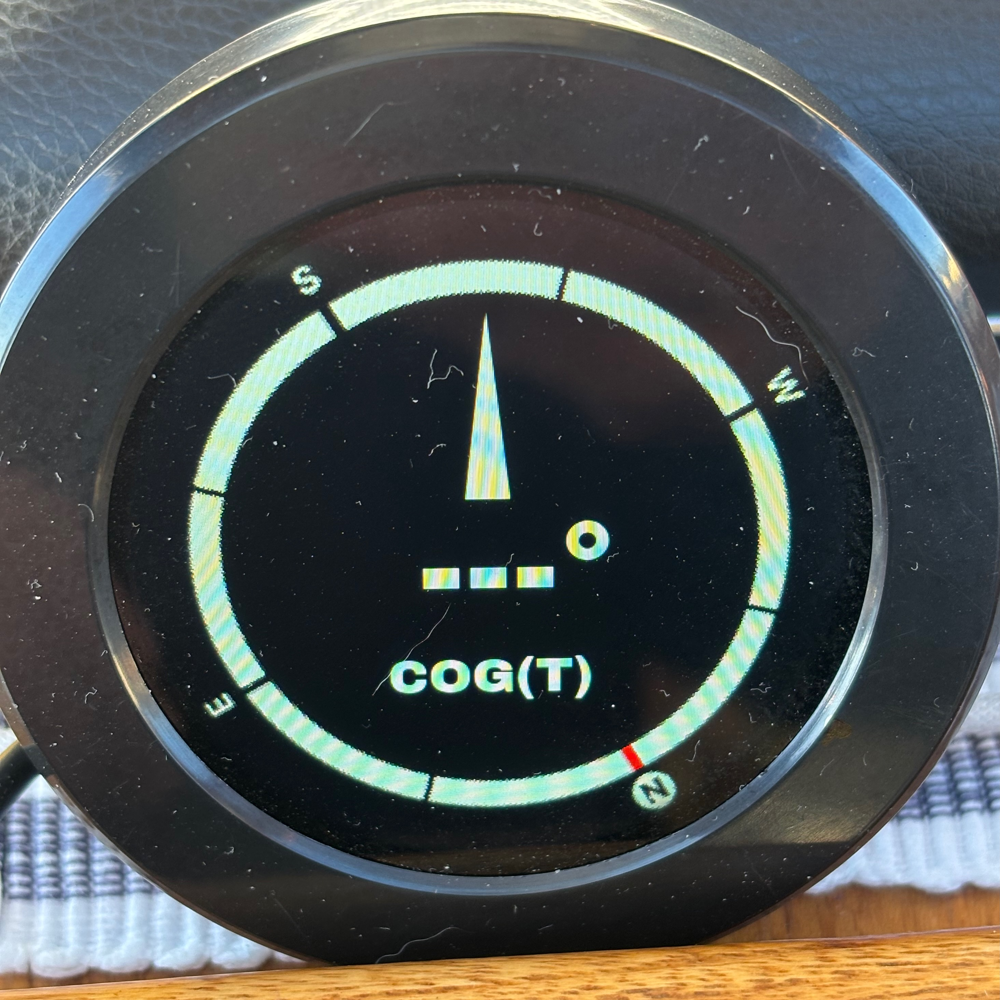

Pressing the knob button cycles between HEADING → COG → SOG → HEADING. Last view stored in NVS `onLeave()` (default: HEADING).

- **HEADING view** — compass rose rotates to HDG(T) from CMPS14. Mode label: `HDG(T)`. Last known heading preserved on disconnect.
- **COG view** — compass rose rotates to COG(T) from GNSS. Mode label: `COG(T)`. Shows `---°` when no valid GNSS fix or sender disconnected.
- **SOG view** — speedometer arc and speed label from GNSS. Arc range 0-100 = 0.0-10.0 kn (arc value = knots x 10). Label format: one decimal place e.g. `7.1`. Shows `--.-` when no valid GNSS fix or sender disconnected.

Common features:
- Heading/COG label format: 3-digit with leading zero e.g. `090°`
- Rotating compass rose image (240x240 px source, rendered at 480x480 with LVGL zoom=512, no alpha, antialias off)
- Rotation threshold 0.5°: skips LVGL re-render when heading/COG change is below threshold
- Connected indicator panel (black = connected, red = disconnected) — tracks active view's data source (CMPS14 for HEADING, GNSS sender for COG/SOG)

### Attitude screen

  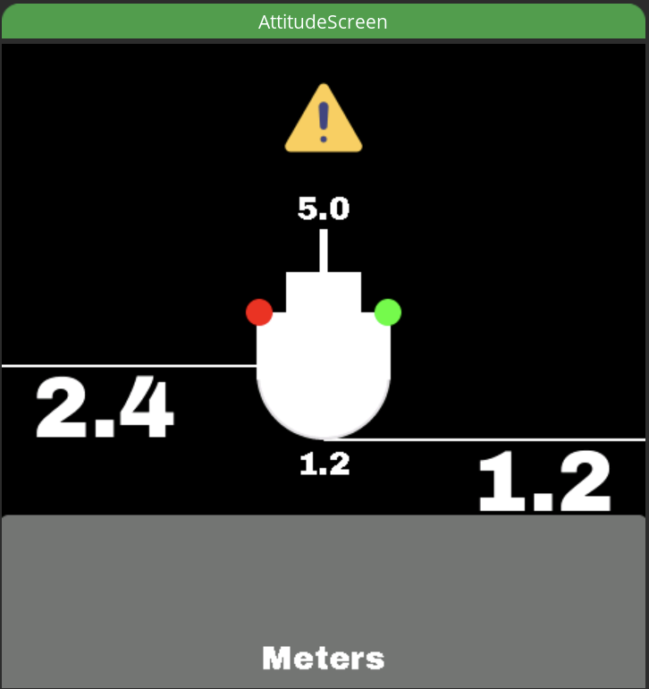   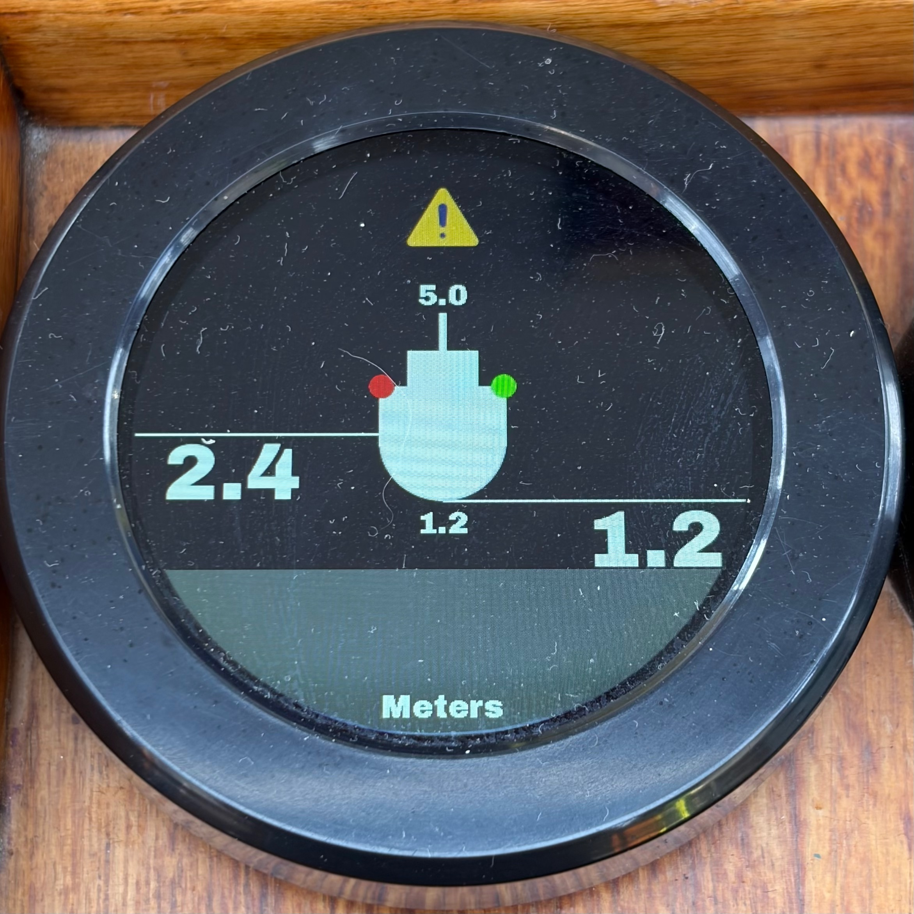

- Pitch and roll min/max values tracked across the full runtime (all screens), no persistent storage in NVS
- Pressing the knob button cycles between ATTITUDE → MINMAX → DEPTH → ATTITUDE view
- Active view is runtime only, not stored in NVS — returning to the screen always loads ATTITUDE view
- ATTITUDE view:
  - Artificial horizon: white 680 x 4 px image that rotates and translates based on pitch and roll
  - Pitch and roll value labels
- MINMAX view:
  - Four horizon lines, all 680 x 4 px images, to show recorded pitch and roll min/max values
    - Yellow, placed horizontally to the max pitch, showing highest bow up position
    - Blue, placed horizontally to the min pitch, showing lowest bow down position
    - Green, pivot at the center, rotated to show max roll, furthest roll position to starboard
    - Red, pivot at the center, rotated to show min roll, furthest roll position to port side
  - Pitch and roll min/max value labels
- DEPTH view:
  - Depth relayed from the SignalK server, not measured on the boat's own bus. Source chain: Raymarine Element 12S sounder → NMEA2000 → SH-wg → UDP → SignalK → `SignalK-ESP-NOW-gateway`
  - Ship silhouette floats between two static white lines: water surface (top) and keel (bottom), 55 px apart representing the 1.2 m draft (45.83 px/m ≈ 2.18 cm/px)
  - Grey sea bottom panel slides vertically with the depth below keel. At 0 m it sits on the keel line (aground) and fills the screen; it is hidden once it has slid entirely off-screen (≈ 4.0 m under the keel)
  - Labels, one decimal place, in meters:
    - Left of the ship, on the surface line: depth below surface
    - Right of the ship, on the keel line: depth below keel
    - Under the hull: draft (1.2, static vessel dimension)
    - On top of the mast: air height (5.0, static vessel dimension)
    - Bottom of the screen: static `Meters` unit label
  - Yellow caution triangle shown when there is less than one draft (1.2 m) of water under the keel
  - Either half of the depth pair is reconstructed from the other through the constant draft if only one arrives; `below_transducer_m` is not used
  - **Two-fold freshness check** — a relayed value carries no freshness of its own, so both are required: the ESP-NOW gateway must be alive (RX timestamp, 6 s) **and** the sounder feed behind it must be fresh (`DepthDelta.age_ms`, 5 s). Either stale, or depth below keel NAN → labels show `--.-` and the bottom panel and caution triangle are hidden. A frozen depth under the keel is worse than none, because the caution triangle is driven by the same number
  - `--.-` at anchor is normal: the plotter feeding `environment.depth.*` into SignalK reports very infrequently while the vessel is stationary
  - Sea bottom rendering throttled to 250 ms and skipped when the computed position has not moved — the panel is 484x185 px and the sounder only updates at ~1 Hz
- Ship silhouette overlay on all three views
  - The red and green "navigation lights" of the ship silhouette hidden when disconnected, shown again when data received from the compass — they follow the compass link in all three views, missing depth does not hide them

### Weather screen

     

- Pressing the knob button toggles between TEMPERATURE → PRESSURE → HUMIDITY → TEMPERATURE view
- Last view stored in NVS `onLeave()`
- Stored view retrieved from NVS when returning to the screen (default: temperature)
- Temperature view: Temperature °C, maximum and minimum
- Pressure view: Pressure hPA, maximum and minimum
- Humidity view: Humidity %, maximum and minimum
- Min and max values are runtime only, not persistent in NVS
- Trend indicators based on EMA. Alpha (0.05) and threshold (0.001) can be adjusted via constants for each view separately

### Battery screen

       

- Pressing the knob button toggles between HOUSE VOLTAGE → HOUSE CURRENT → HOUSE SOC → STARTER VOLTAGE → HOUSE VOLTAGE view
- Last view stored in NVS `onLeave()`
- Stored view retrieved from NVS when returning to the screen (default: house voltage)
- House voltage view: voltage V, maximum and minimum
- House current view: current A, maximum and minimum
- House SoC view: state-of-charge %, maximum and minimum
- Min and max values are runtime only, not persistent in NVS
- Trend indicators based on EMA. Alpha (0.05) and threshold (0.001) can be adjusted via constants for each view separately

### Engine screen

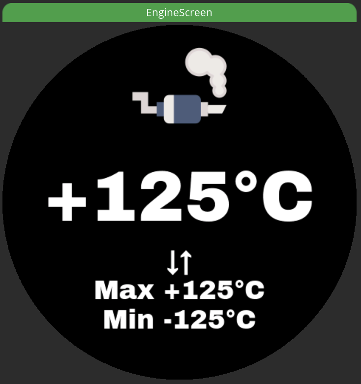 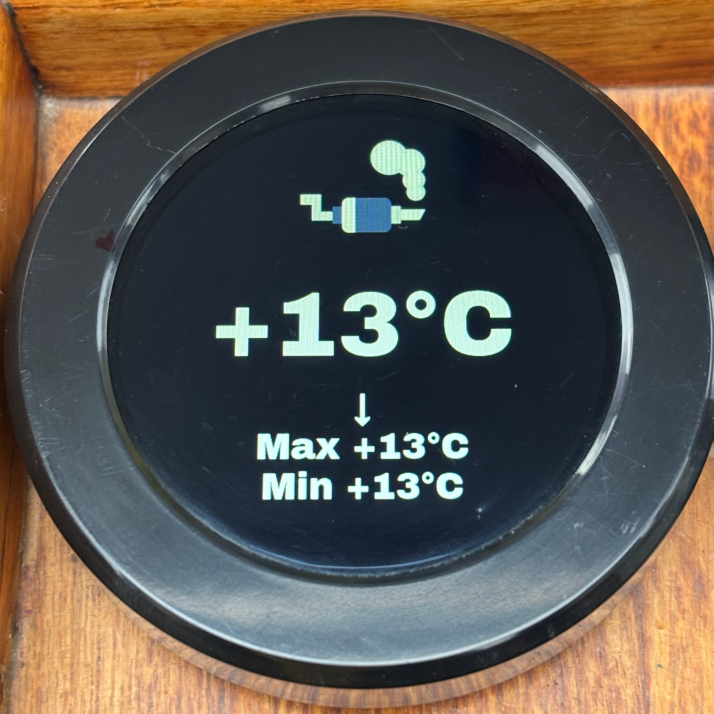 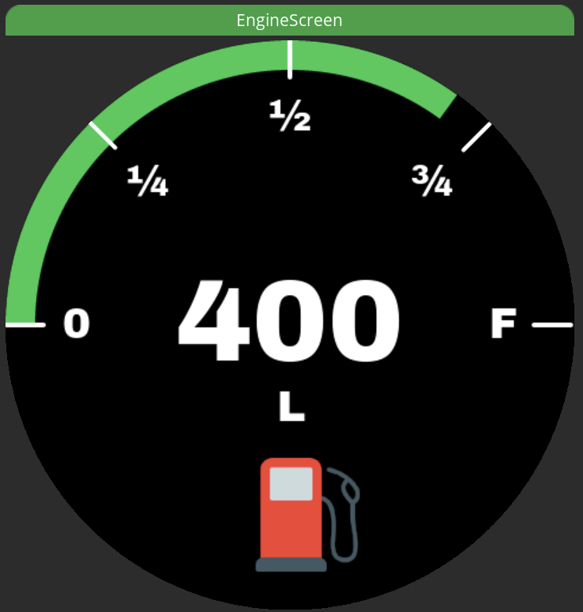 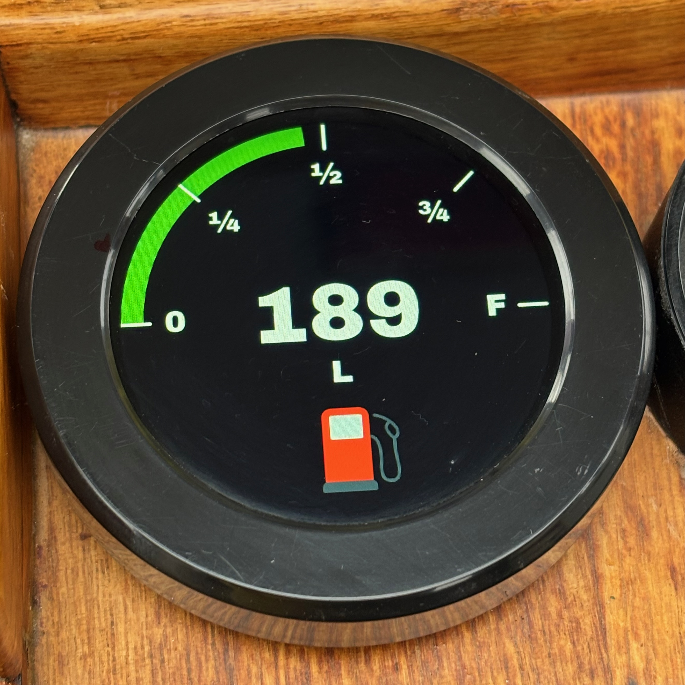 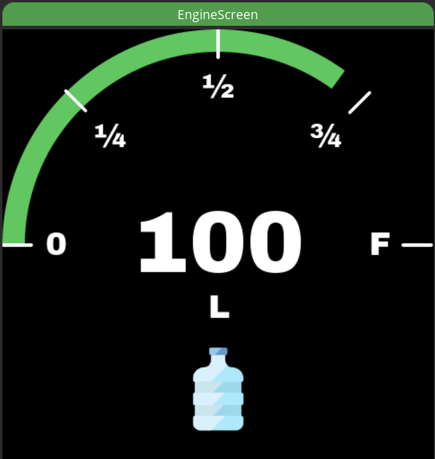 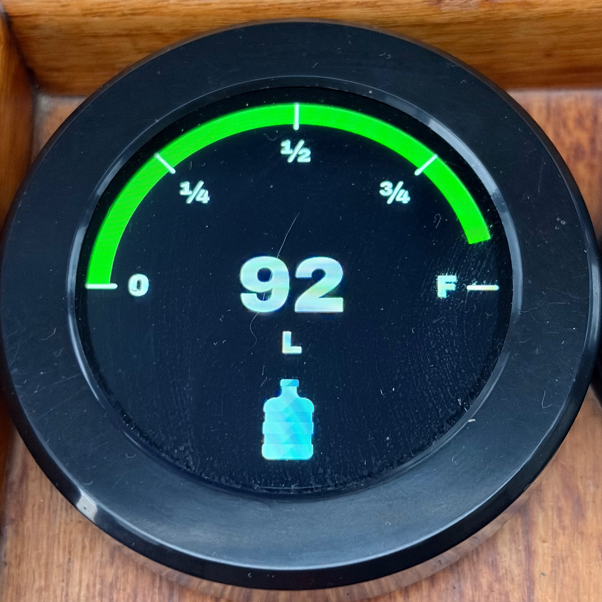

- Pressing the knob button cycles between EXHAUST → FUEL0 → FRESHWATER → EXHAUST view
- Last view stored in NVS `onLeave()` (default: EXHAUST)
- Engine, fuel tank and fresh water tank connections tracked independently; timeout: 6 seconds

**EXHAUST view:**
- Exhaust temperature in °C (converted from Kelvin)
- Session min and max temperatures (runtime only, not persistent in NVS)
- Trend indicator (↑/↓) based on EMA — hidden until stable or until second reading arrives

**FUEL0 view:**
- Fuel arc gauge: arc range 0–100 % of tank, label shows calculated litres (tank capacity: 400 L)
- Dynamic arc color based on fuel level:
  - Green: ≥ 25 %
  - Yellow: 10–25 %
  - Red: < 10 %
- On disconnect: labels show `"---"`

**FRESHWATER view:**
- Fresh water arc gauge: arc range 0–100 % of tank, label shows calculated litres (tank capacity: 80 L)
- Same dynamic arc colors and thresholds as the fuel gauge (green ≥ 25 %, yellow 10–25 %, red < 10 %)
- Own arc render cache and connection tracking, independent of the fuel and exhaust feeds
- On disconnect: labels show `"---"`

### Brightness screen

 

- Sun icon image and current brightness percentage label
- Knob button press enters ADJUSTING mode: arc overlay appears
- Knob rotation in ADJUSTING mode: ±2% brightness, updates arc, label and backlight in real-time
- 3-second timeout after last rotation → saves to NVS and returns to idle
- Brightness range: 2%-100% (2% minimum prevents screen going completely dark)
- Default: 48% (~122/255)
- Persistence: ESP32 Preferences (NVS), namespace `"display"`, key `"brightness"`
- PWM: GPIO6, 5 kHz, 8-bit

### Knob behavior

| Screen | Button press | Rotation (normal) | Rotation (special) |
|--------|--------------|-------------------|--------------------|
| Compass | Cycle HEADING/COG/SOG view | Switch screen | — |
| Attitude | Cycle ATTITUDE/MINMAX/DEPTH view | Switch screen | — |
| Weather | Toggle TEMPERATURE/PRESSURE/HUMIDITY view | Switch screen | — |
| Battery | Toggle HOUSE VOLTAGE/HOUSE CURRENT/HOUSE SOC/STARTER VOLTAGE view | Switch screen | — |
| Engine | Cycle EXHAUST/FUEL0/FRESHWATER view | Switch screen | — |
| Brightness | Enter ADJUSTING mode | Switch screen | ±2% brightness (ADJUSTING mode only) |

Screen carousel order:
- **Clockwise:** COMPASS → ATTITUDE → WEATHER → BATTERY → ENGINE → BRIGHTNESS → COMPASS
- **Counter-clockwise:** COMPASS → BRIGHTNESS → ENGINE → BATTERY → WEATHER → ATTITUDE → COMPASS

Screen carousel is scalable, new screens may be added.

### ESP-NOW communication

All ESP-NOW messages are wrapped in the payload of `ESPNowPacket`.
```cpp
template <typename TPayload>
  struct ESPNowPacket {
    ESPNowHeader hdr;
    TPayload payload;
} __attribute__((packed));
```

`ESPNowHeader` contains `ESPNOW_MAGIC = 0x45534E57' ("ESNW") which identifies the packets from others on the same channel.

```cpp
struct ESPNowHeader {
   uint32_t magic;           // ESPNOW_MAGIC ('E''S''N''W')
   uint8_t  msg_type;        // ESPNowMsgType
   uint8_t  payload_len;     // payload length in bytes (max 250)
   uint8_t  reserved[2];     // padding, set to zero
} __attribute__((packed));
```

`ESPNowMsgType` identifies the content delivered, topped with the payload length information in the header.

`espnow_protocol.h` is a shared file, copied by hand into every ESP32 project on the boat, and `ESPNowMsgType` is a single fleet-wide number space. A change is not done until every copy is identical — never reconcile two versions field by field.

Sample types:

```cpp
enum class ESPNowMsgType : uint8_t {
   HEADING_DELTA        = 1,  // CMPS14-ESP32-SignalK-gateway
   BATTERY_DELTA        = 2,  // VEDirect-ESP32-SignalK-gateway
   WEATHER_DELTA        = 3,  // BME280-ESP32-SignalK-gateway
   GNSS_DELTA           = 4,  // UBLOX-ESP32-SignalK-gateway
   HALMET_ENGINE_DELTA  = 5,  // HALMET-ESP32-SignalK-gateway
   HALMET_TANK_DELTA    = 6,  // HALMET-ESP32-SignalK-gateway
   HALMET_WATER_DELTA   = 7,  // HALMET-ESP32-SignalK-gateway
   DEPTH_DELTA          = 8,  // SignalK-ESP-NOW-gateway
   DATETIME_DELTA       = 9,  // UBLOX-ESP32-SignalK-gateway
};
```

Types 1-8 are consumed by this project. `DATETIME_DELTA` (9) exists in the shared protocol for other receivers on the boat and is ignored here.

Sample payloads:

```cpp
struct HeadingDelta {
   float heading_rad;       // Magnetic heading (radians)
   float heading_true_rad;  // True heading (radians)
   float pitch_rad;         // Pitch (radians)
   float roll_rad;          // Roll (radians)
};

struct WeatherDelta {
   float temperature_c;   // °C
   float humidity_p;      // percent
   float pressure_hpa;    // hPa
};

struct BatteryDelta {
   float house_voltage;   // house bank volts
   float house_current;   // house bank amps
   float house_power;     // house bank watts
   float house_soc;       // house bank soc percent
   float start_voltage;   // starter battery volts
};

struct GnssDelta {
   float lat_deg;        // Latitude, decimal degrees
   float lon_deg;        // Longitude, decimal degrees
   float sog_ms;         // Speed over ground, m/s
   float cog_true_rad;   // Course over ground (true), radians
   float mag_var_rad;    // Magnetic variation (WMM), radians — NAN until first fix
   uint8_t satellites;   // SIV
   uint8_t fix_type;     // 0=no fix, 3=3D, 4=GNSS+DR
   uint8_t fix_ok;       // getGnssFixOk() ? 1 : 0
   uint8_t reserved;
};

struct HALMETEngineDelta {
   float exhaust_temp_k;    // propulsion.0.exhaustTemperature [K]
};

struct HALMETTankDelta {
   float fuel_level_ratio;  // tanks.fuel.0.currentLevel [0.0..1.0]
};

struct HALMETWaterDelta {
   float water_level_ratio;  // tanks.freshWater.0.currentLevel [0.0..1.0]
};

// Depth relayed from the SignalK server, not measured locally.
// A relayed value carries no freshness of its own, so both signals are required:
//   - a field is NAN when that individual path is stale or has never arrived
//   - age_ms describes the depth feed as a whole (bottom lost, or N2K chain down)
struct DepthDelta {
   float    below_surface_m;     // environment.depth.belowSurface [m]
   float    below_transducer_m;  // environment.depth.belowTransducer [m]
   float    below_keel_m;        // environment.depth.belowKeel [m]
   uint32_t age_ms;              // ms since the freshest of the three; UINT32_MAX = never received
};
```

**Receives** at ~20 Hz, in radians (sent by CMPS14-ESP32-SignalK-gateway), as broadcast:
- `ESPNowPacket<HeadingDelta>`:
  - 24 B packet, 8 B header + 16 B payload
  - Payload: `HeadingDelta` struct (`heading_rad`, `heading_true_rad`, `pitch_rad`, `roll_rad` - equal to what SignalK server gets from the gateway)
  - `HeadingDelta` converted into `HeadingData`, an internal data struct for CrowPanel implementation

**Receives** at ~0.5 Hz, in °C, % and hPA (sent by BME280-ESP32-SignalK-gateway), as broadcast:
- `ESPNowPacket<WeatherDelta>`:
  - 20 B packet, 8 B header + 12 B payload
  - Payload: `WeatherDelta` struct (`temperature_c`, `humidity_p`, `pressure_hpa`)

**Receives** at ~1 Hz (sent by UBLOX-ESP32-SignalK-gateway), as broadcast:
- `ESPNowPacket<GnssDelta>`:
  - 32 B packet, 8 B header + 24 B payload
  - Payload: `GnssDelta` struct (`lat_deg`, `lon_deg`, `sog_ms`, `cog_true_rad`, `mag_var_rad`, `satellites`, `fix_type`, `fix_ok`)
  - `GnssDelta` converted into `GnssData`, an internal data struct: `cog_true_x10` (0-3599), `sog_knots_x10` (knots x 10), `fix_ok`

**Receives** at ~1 Hz, in V, A and % (sent by VEDirect based sender), as broadcast:
- `ESPNowPacket<BatteryDelta>`:
  - 28 B packet, 8 B header + 20 B payload
  - Payload: `BatteryDelta` struct (`house_voltage`, `house_current`, `house_power`, `house_soc`, `start_voltage`)

**Receives** at ~1 Hz (sent by HALMET-ESP32-SignalK-gateway), as broadcast:
- `ESPNowPacket<HALMETEngineDelta>`:
  - 12 B packet, 8 B header + 4 B payload
  - Payload: `HALMETEngineDelta` struct (`exhaust_temp_k` — converted to °C in `EngineUI`)
- `ESPNowPacket<HALMETTankDelta>`:
  - 12 B packet, 8 B header + 4 B payload
  - Payload: `HALMETTankDelta` struct (`fuel_level_ratio` — 0.0 to 1.0, scaled to litres in `EngineUI`)
- `ESPNowPacket<HALMETWaterDelta>`:
  - 12 B packet, 8 B header + 4 B payload
  - Payload: `HALMETWaterDelta` struct (`water_level_ratio` — 0.0 to 1.0, scaled to litres in `EngineUI`)

**Receives** at ~1 Hz, in meters (sent by SignalK-ESP-NOW-gateway), as broadcast:
- `ESPNowPacket<DepthDelta>`:
  - 24 B packet, 8 B header + 16 B payload
  - Payload: `DepthDelta` struct (`below_surface_m`, `below_transducer_m`, `below_keel_m`, `age_ms`)
  - Relayed from SignalK, not measured on the boat's own bus — `AttitudeUI` gates it on both the ESP-NOW RX timestamp (6 s) and the in-payload `age_ms` (5 s)

**Channel:** ESP-NOW evices must be on the same WiFi channel. Configured to channel 6 (`static constexpr uint8_t ESP_NOW_CHANNEL = 6` in `CrowPanelApplication.h`). Set your router to a fixed channel 6. This allows senders to operate both on WiFi and ESP-NOW, using WiFi's channel for ESP-NOW. Avoid channel jumping by setting a fixed channel in the router.

**Deadband:** Compass sender has 0.05° deadband — no packet sent if heading and attitude change less than 0.05°. CrowPanel has an additional 0.5° threshold for compass rose rotation rendering only.

**NOTE:** Requires CMPS14-ESP32-SignalK-gateway v1.3.0, UBLOX-ESP32-SignalK-gateway v1.0.0, BME280-ESP32-SignalK-gateway v1.0.0, HALMET-ESP32-SignalK-gateway v1.3.0 (fresh water tank) and SignalK-ESP-NOW-gateway v1.0.0 (depth), or newer.

## Project structure

| File(s) | Description |
|---------|-------------|
| `ESP32-Crowpanel-compass.ino` | Owns `CrowPanelApplication app`, contains `setup()` and `loop()` |
| `CrowPanelApplication.h/.cpp` | Class CrowPanelApplication, the "app" — owns all instances |
| `espnow_protocol.h` | Wire protocol (namespace `ESPNow`), shared by hand across every ESP32 project on the boat: `ESPNowHeader`, `ESPNowPacket<T>`, `ESPNowMsgType`, `HeadingData/Delta`, `GnssData/Delta`, `WeatherDelta`, `BatteryDelta`, `HALMETEngineDelta`, `HALMETTankDelta`, `HALMETWaterDelta`, `DepthDelta`, `DateTimeDelta` |
| `IScreenUI.h` | Abstract base class for all UI adapter class implementations |
| `ESPNowReceiver.h/.cpp` | Class `ESPNowReceiver` — ESP-NOW receive (receive-only) |
| `CompassUI.h/.cpp` | Class `CompassUI` — compass screen adapter, realizes `IScreenUI` |
| `AttitudeUI.h/.cpp` | Class `AttitudeUI` — attitude screen adapter, realizes `IScreenUI` |
| `WeatherUI.h/cpp` | Class `WeatherUI` - weather screen adapter, realizes `IScreenUI` |
| `BatteryUI.h/cpp` | Class `BatteryUI` — battery screen adapter, realizes `IScreenUI` |
| `EngineUI.h/.cpp` | Class `EngineUI` — engine screen adapter, realizes `IScreenUI` |
| `BrightnessUI.h/.cpp` | Class `BrightnessUI` — brightness screen adapter + adjustment state machine, realizes `IScreenUI` |
| `RotaryEncoder.h/.cpp` | Class `RotaryEncoder` — rotary knob rotation and button, FreeRTOS tasks |
| `ScreenManager.h/.cpp` | Class `ScreenManager` — Scalable screen carousel management |
| `lv_conf.h` | LVGL configuration file based on the template provided by LVGL library |
| `Crowpanel_ST7701_Init.h/.cpp` | `Arduino_RGB_Display` init table for CrowPanel display - `crowpanel_st7701_type5_init_operations` |
| `ui.h/.c` | SquareLine Studio generated — UI init |
| `ui_CompassScreen.h/.c` | SquareLine Studio generated |
| `ui_AttitudeScreen.h/.c` | SquareLine Studio generated |
| `ui_WeatherScreen.h/.c` | SquareLine Studio generated | 
| `ui_BatteryScreen.h/.c` | SquareLine Studio generated |
| `ui_EngineScreen.h/.c` | SquareLine Studio generated |
| `ui_BrightnessScreen.h/.c` | SquareLine Studio generated |
| `ui_helpers.h/.c` | SquareLine Studio generated |
| `ui_font_*.c` | Custom fonts |
| `ui_img_*.c` | Images (compass rose, icons) |
| `UI/` | SquareLine Studio project |
| `docs/`| Other documents |

## Hardware

### Bill of materials

1. [Elecrow CrowPanel 2.1" HMI ESP32 Rotary Display](https://www.elecrow.com/wiki/CrowPanel_2.1inch-HMI_ESP32_Rotary_Display_480_IPS_Round_Touch_Knob_Screen.html), having:
   - ESP32-S3 module
   - 480x480 IPS round display (ST7701, RGB interface)
   - Rotary encoder with push button (PCF8574 I2C GPIO expander at 0x21)
2. WiFi router with fixed channel 6
3. [CMPS14-ESP32-SignalK-gateway](https://github.com/mkvesala/CMPS14-ESP32-SignalK-gateway) as ESP-NOW sender
4. [UBLOX-ESP32-SignalK-gateway](https://github.com/mkvesala/UBLOX-ESP32-SignalK-gateway) as ESP-NOW sender
5. [BME280-ESP32-SignalK-gateway](https://github.com/mkvesala/BME280-ESP32-SignalK-gateway) as ESP-NOW sender
6. [VEDirect-ESP32-SignalK-gateway](https://github.com/mkvesala/VEDirect-ESP32-SignalK-gateway) as ESP-NOW sender
7. [HALMET-ESP32-SignalK-gateway](https://github.com/mkvesala/HALMET-ESP32-SignalK-gateway) as ESP-NOW sender
8. [SignalK-ESP-NOW-gateway](https://github.com/mkvesala/SignalK-ESP-NOW-gateway) as ESP-NOW sender (relays depth from the SignalK server)
9. [3D-printed mounting frame for CrowPanel](docs/CrowPanel_2_1_HMI_mounting.stl):

   

**No paid partnerships.**

## Software

1. Arduino IDE 2.3.8
2. Espressif Systems esp32 board package 3.3.8
3. Additional libraries:
   - LVGL 9.5.0
   - Arduino GFX Library (by Moon On Our Nation) 1.6.5
   - PCF8574 (by Renzo Mischianti) 2.4.0
4. SquareLine Studio 1.6.0 for UI design and code generation
5. CMPS14-ESP32-SignalK-gateway v1.4.0
6. UBLOX-ESP32-SignalK-gateway v1.0.0
7. BME280-ESP32-SignalK-gateway v1.0.1
8. VEDirect-ESP32-SignalK-gateway v1.0.0
9. HALMET-ESP32-SignalK-gateway v1.3.0
10. SignalK-ESP-NOW-gateway v1.0.0

## Installation

1. Clone the repo
   ```
   git clone https://github.com/mkvesala/ESP32-Crowpanel-compass.git
   ```
2. Alternatively, download the code as zip
3. Install required libraries in Arduino IDE (LVGL, Arduino_GFX_Library, PCF8574)
4. Set ESP-NOW channel in `CrowPanelApplication.h` to match your router:
   ```cpp
   static constexpr uint8_t ESP_NOW_CHANNEL = 6;
   ```
5. Connect and power up the CrowPanel with USB
6. Compile and upload with Arduino IDE (board: ESP32S3 Dev Module)
7. Point the ESP-NOW senders to the same WiFi channel

**Note** that `lv_conf.h` is in project root (with default values from the library template). If you are using LVGL elsewhere, this file is probably under `Arduino/libraries/` folder next to `lvgl` library folder. Check the settings and use either one to avoid conflicts.

**SquareLine Studio note:** SquareLine Studio clears the export directory completely on export. Always git commit before exporting from SquareLine Studio and set a temporary directory in project settings for the export folder.

## Todo

Check [open issues](https://github.com/mkvesala/ESP32-Crowpanel-compass/issues).

## Debug

Performance characteristics on CrowPanel 2.1" (ESP32-S3):

| Screen | UI updates/5s | LVGL avg | LVGL max | Notes |
|--------|--------------|----------|----------|-------|
| Compass (heading changing) | ~52 | ~48 ms | ~160 ms | 240x240 zoom=512, no alpha, antialias off, draw buffer 120 lines, adaptive LVGL tick scheduling |
| Compass (stable heading) | 48-74 | 1-7 ms | — | 0.5° threshold prevents unnecessary re-renders |
| Attitude (data flowing) | ~80 | 4-13 ms | — | Horizon line 680x4 px is cheap to render |
| Attitude (stable) | ~83 | <1 ms | — | Nothing to render |

Compass rose `lv_image_set_rotation()` is the main performance bottleneck (only on the compass screen). PNG image stored in the image object is 240x240 pixels, no alpha, scaled with LVGL factor 512 to 480x480 pixels. Antialiasing is off. LVGL rendering is based on partial mode, using buffer of 480x120.

Flash usage: ~74%.

## Security

**Use at your own risk — not for safety-critical navigation!**

This device receives data only via ESP-NOW broadcast on a local WiFi channel. There is no network server, no authentication and no sensitive data. Keep the device on a private boat WiFi network.

## Credits

Software and libraries used are documented in the above sections.

Inspired by [example source code by Elecrow](https://github.com/Elecrow-RD/CrowPanel-2.1inch-HMI-ESP32-Rotary-Display-480-480-IPS-Round-Touch-Knob-Screen).

[Humidity icons created by Freepik - Flaticon](https://www.flaticon.com/free-icons/humidity)

[Temperature icons created by Freepik - Flaticon](https://www.flaticon.com/free-icons/temperature)

[Sun icons created by Freepik - Flaticon](https://www.flaticon.com/free-icons/sun)

[Battery icons created by Freepik - Flaticon](https://www.flaticon.com/free-icons/battery)

[Pressure icons created by Muhammad Ali - Flaticon](https://www.flaticon.com/free-icons/pressure)

[Exhaust pipe icons created by Iconiyo - Flaticon](https://www.flaticon.com/free-icons/exhaust-pipe)

[Gas icons created by Pixel perfect - Flaticon](https://www.flaticon.com/free-icons/gas)

[Gallon bottle icons created by AbtoCreative - Flaticon](https://www.flaticon.com/free-icons/gallon-bottle)

[Caution icons created by agus raharjo - Flaticon](https://www.flaticon.com/free-icons/caution)

This is a companion project to my [CMPS14-ESP32-SignalK-gateway](https://github.com/mkvesala/CMPS14-ESP32-SignalK-gateway), [VEDirect-ESP32-SignalK-gateway](https://github.com/mkvesala/VEDirect-ESP32-SignalK-gateway), [BME280-ESP32-SignalK-gateway](https://github.com/mkvesala/BME280-ESP32-SignalK-gateway), [UBLOX-ESP32-SignalK-gateway](https://github.com/mkvesala/UBLOX-ESP32-SignalK-gateway), [HALMET-ESP32-SignalK-gateway](https://github.com/mkvesala/HALMET-ESP32-SignalK-gateway) and [SignalK-ESP-NOW-gateway](https://github.com/mkvesala/SignalK-ESP-NOW-gateway). Check the UML diagram below to see how these projects relate:


No paid partnerships.

Developed by Matti Vesala in collaboration with Claude.

See [CONTRIBUTING.md](CONTRIBUTING.md) for further details on development.

## Gallery

                                   
